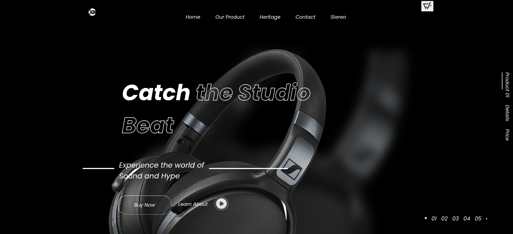

# Headphones Landing Page

A clean and modern landing page for a headphone product, built from scratch using HTML and CSS. This layout was implemented based on a Figma design.

---

## Features

- Pixel-perfect layout based on Figma design
- Responsive-friendly adjustments (up to 768px)
- Grid & Flexbox layout techniques
- Custom typography with Google Fonts
- Multi-layer image composition (blur & overlay effects)
- Clean and semantic HTML structure

---

## Screenshots

---

## Tech Stack

- HTML5
- CSS3 (pure CSS, no frameworks)
- Google Fonts (`Poppins`)

---

## Responsiveness

The original Figma design was desktop-only. However, base responsive behaviors were added to ensure the layout doesn't break on tablets and smaller screens.

---

## Notes

- This project was created as part of a personal front-end practice.
- Can be used as a portfolio project or for freelance demo purposes.
- No JavaScript was used — only HTML and CSS.

---

## Contact

Feel free to reach out if you have questions or want to collaborate!

---

## Demo preview

[Site preview](https://yari4ek89.github.io/headphonesLanding/)
